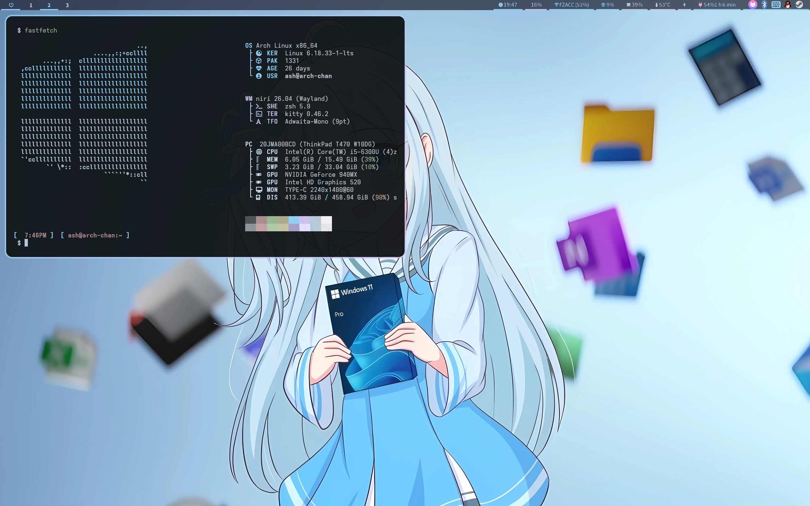
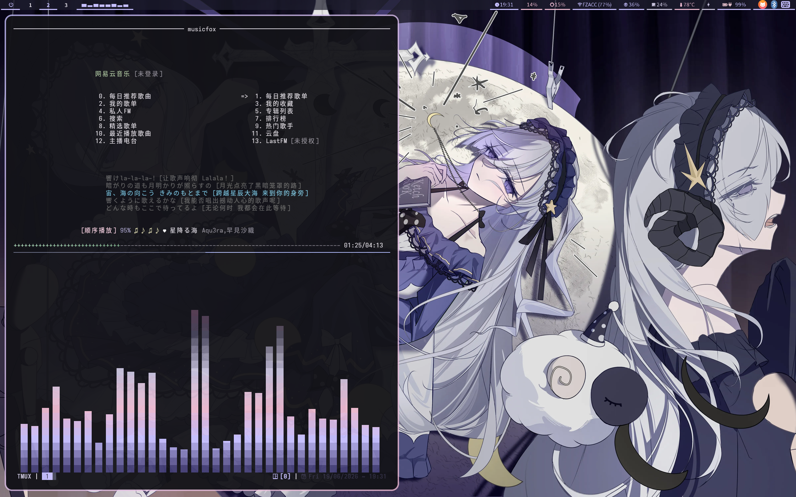
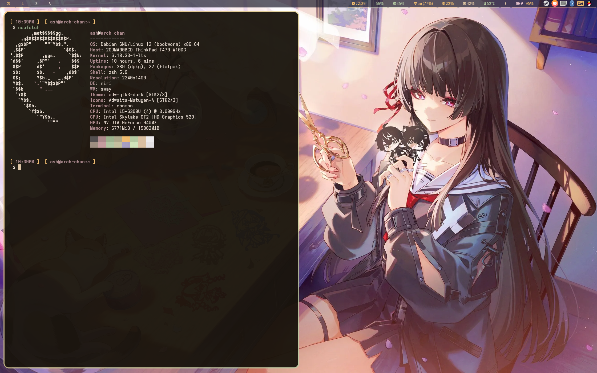

<h1 align="center">
  
  Niri Dotfiles
  
</h1>

<p align="center">
   <a href="#features">Features</a> • 
   <a href="#gallery">Gallery</a> •
   <a href="#dependencies">Dependencies</a> • 
   <a href="#ui--icon-themes">UI & Icons</a> • 
   <a href="#wallpaper-following-theme">Theme</a> • 
   <a href="#installation">Installation</a> • 
   <a href="#keybinds">Keybinds</a>
</p>

## Features

- Niri wayland compositor with custom scripts
- Waybar status bar with Win11-like layout
- Matugen dynamic color scheme generation
- Fcitx5 input method
- Kitty terminal
- Neovim with full plugin setup
- Tmux configuration
- Fish, Bash, Zsh shell configs
- MPV with custom scripts
- Cava audio visualizer
- Btop system monitor
- Mako notifications
- Fuzzel app launcher
- GTK theme integration
- Automatic wallpaper-following theme switching via matugen

## Gallery

| Wallpaper-Following Theme             |
| ------------------------------------- |
|  |

| Cava & Musicfox                       |
| ------------------------------------- |
|  |

| Terminal                              |
| ------------------------------------- |
|  |

## Dependencies

| Name | Used For | Link |
| --- | --- | --- |
| `niri` | Wayland compositor | [niri](https://github.com/YaLTeR/niri) |
| `waybar` | Status bar | [waybar](https://github.com/Alexays/Waybar) |
| `kitty` | Terminal emulator | [kitty](https://github.com/kovidgoyal/kitty) |
| `fcitx5` | Input method | [fcitx5](https://fcitx-im.org/) |
| `nvim` | Text editor | [neovim](https://github.com/neovim/neovim) |
| `tmux` | Terminal multiplexer | [tmux](https://github.com/tmux/tmux) |
| `mpv` | Media player | [mpv](https://mpv.io/) |
| `cava` | Audio visualizer | [cava](https://github.com/karlstav/cava) |
| `btop` | System monitor | [btop](https://github.com/aristocratos/btop) |
| `mako` | Notification daemon | [mako](https://github.com/emersion/mako) |
| `fuzzel` | App launcher | [fuzzel](https://codeberg.org/dnkl/fuzzel) |
| `matugen` | Material You colors | [matugen](https://github.com/InioX/matugen) |
| `swaylock` | Screen locker | [swaylock](https://github.com/swaywm/swaylock) |
| `starship` | Shell prompt | [starship](https://github.com/starship/starship) |
| `yazi` | File manager | [yazi](https://github.com/sxyazi/yazi) |

## UI & Icon Themes

| Name | Used For | Link |
| --- | --- | --- |
| `Adwaita-Matugen-A` | Icon theme | Custom Matugen-generated |
| `JetBrains Mono Nerd Font` | UI font | [JetBrainsMono-NF](https://github.com/ryanoasis/nerd-fonts) |

## Installation

1. **Clone the repository**
   ```bash
   git clone https://github.com/bt-ASH/dotfile-niri.git ~/dotfile-niri
   ```

2. **Copy configs**
   ```bash
   cp -r ~/dotfile-niri/.config/* ~/.config/
   cp ~/dotfile-niri/.bashrc ~/.bashrc
   cp ~/dotfile-niri/.bash_profile ~/.bash_profile
   cp ~/dotfile-niri/.zshrc ~/.zshrc
   cp ~/dotfile-niri/.vimrc ~/.vimrc
   ```

3. **Install dependencies**
   - Install the packages listed in the Dependencies table above using your package manager.

4. **Restart Niri**
   - Log out and log back in, or restart Niri to apply changes.

## Wallpaper-Following Theme

This dotfiles setup uses **[matugen](https://github.com/InioX/matugen)** to automatically generate a full Material You color scheme from your current wallpaper. When the wallpaper changes, matugen extracts the dominant colors and regenerates theme files for all supported apps in one go.

> Inspired by [shorinkiwata](https://space.bilibili.com/9202840) on Bilibili.

**Supported apps:**

| App | Template | Output |
| --- | --- | --- |
| Waybar | `colors.css` | `~/.config/waybar/colors.css` |
| Kitty | `kitty-colors.conf` | `~/.config/kitty/themes/matugen.conf` |
| Fuzzel | `fuzzel.ini` | `~/.config/fuzzel/colors.ini` |
| Fcitx5 | `fcitx5-theme.conf` | `~/.local/share/fcitx5/themes/Matugen/theme.conf` |
| Mako | `mako-colors.conf` | `~/.config/mako/colors.conf` |
| Btop | `btop.theme` | `~/.config/btop/themes/matugen.theme` |
| Cava | `cava-colors.ini` | `~/.cache/matugen/cava-colors.ini` |
| Clipse | `clipse-theme.json` | `~/.cache/matugen/clipse-theme.json` |
| Starship | `starship-colors.toml` | `~/.config/starship.toml` |
| Yazi | `yazi-theme.toml` | `~/.config/yazi/theme.toml` |
| GTK 3/4 | `gtk-colors.css` | `~/.config/gtk-{3,4}.0/colors.css` |
| Pywalfox | `pywalfox-colors.json` | `~/.cache/wal/colors.json` |

**Workflow:**

1. Change wallpaper with `set-wallpaper.sh /path/to/wallpaper.jpg`
2. Wallpaper is applied and overview blur is updated
3. Matugen extracts colors and regenerates all theme files
4. Post-hooks reload each app to pick up the new colors

See [Scripts-chan](https://github.com/bt-ASH/Scripts-chan) for the full Niri environment setup including matugen configuration.

## Keybinds

| Action | Shortcut |
| --- | --- |
| Terminal | `Super + Enter` |
| Close window | `Super + Q` |
| Toggle floating | `Super + Space` |
| Launcher | `Super + D` |
| Lock screen | `Super + Escape` |

## Notes

- Configured for Arch Linux with Niri wayland compositor
- Color schemes are dynamically generated using Matugen
- Custom scripts are located in `~/.config/niri/scripts/`
- Waybar has two variants: default and Win11-like layout

## License

This project is licensed under the GNU General Public License v3.0 - see the [LICENSE](LICENSE) file for details.
