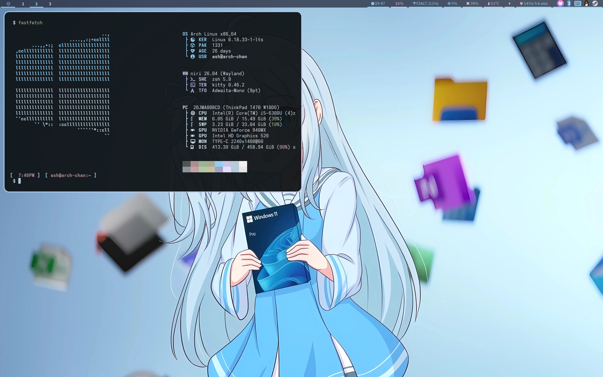
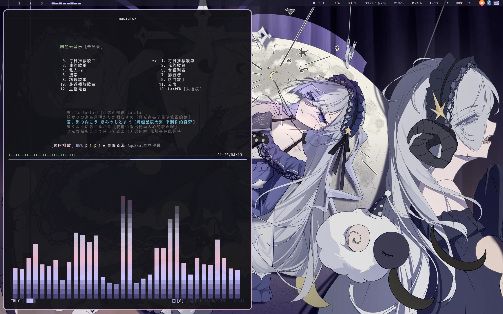
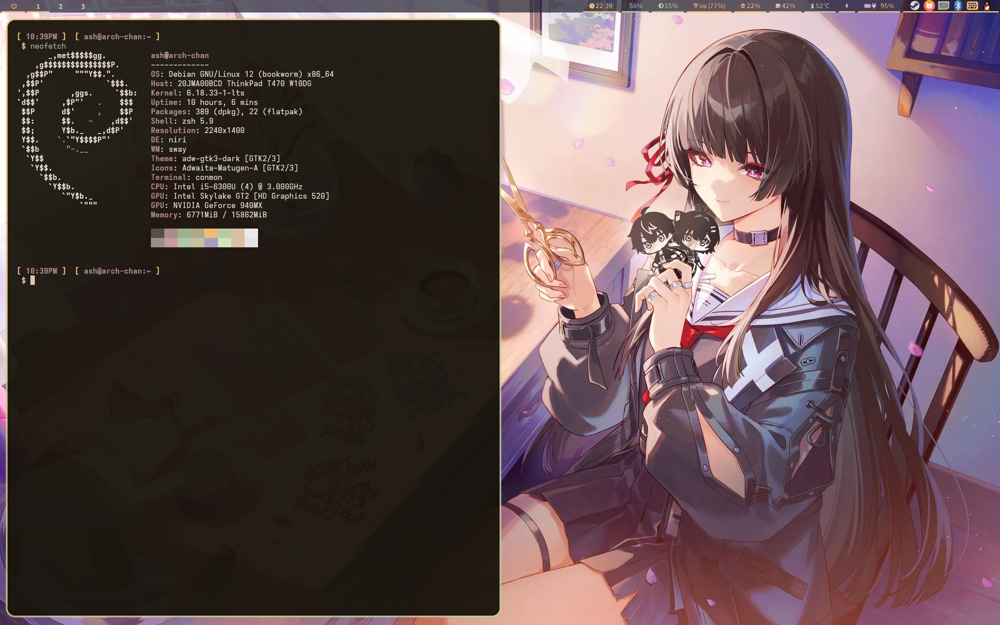

<h1 align="center">
  
  Niri Dotfiles
  
</h1>

<p align="center">
   <a href="#功能特性">功能特性</a> • 
   <a href="#展示">展示</a> •
   <a href="#依赖">依赖</a> • 
   <a href="#ui-与图标主题">UI 与图标</a> • 
   <a href="#壁纸跟随主题">主题</a> • 
   <a href="#安装">安装</a> • 
   <a href="#快捷键">快捷键</a>
</p>

## 功能特性

- Niri Wayland 合成器 + 自定义脚本
- eww 状态栏
- Matugen 动态配色方案生成
- Fcitx5 输入法
- Kitty 终端
- Neovim 完整插件配置
- Tmux 配置
- Fish shell 配置
- MPV + 自定义脚本
- Cava 音频可视化
- Btop 系统监控
- Mako 通知
- Fuzzel 应用启动器
- GTK 主题联动
- 基于 Matugen 的壁纸跟随主题自动切换

## 展示

| 壁纸跟随主题                           |
| ------------------------------------- |
|  |

| Cava 与 Musicfox                      |
| ------------------------------------- |
|  |

| 终端                                  |
| ------------------------------------- |
|  |

## 依赖

| 名称 | 用途 | 链接 |
| --- | --- | --- |
| `niri` | Wayland 合成器 | [niri](https://github.com/YaLTeR/niri) |
| `eww` | 状态栏 | [eww](https://github.com/linkfrg/dotfiles/tree/eww) |
| `kitty` | 终端模拟器 | [kitty](https://github.com/kovidgoyal/kitty) |
| `fcitx5` | 输入法 | [fcitx5](https://fcitx-im.org/) |
| `nvim` | 文本编辑器 | [neovim](https://github.com/neovim/neovim) |
| `tmux` | 终端复用器 | [tmux](https://github.com/tmux/tmux) |
| `mpv` | 媒体播放器 | [mpv](https://mpv.io/) |
| `cava` | 音频可视化 | [cava](https://github.com/karlstav/cava) |
| `btop` | 系统监控 | [btop](https://github.com/aristocratos/btop) |
| `mako` | 通知守护进程 | [mako](https://github.com/emersion/mako) |
| `fuzzel` | 应用启动器 | [fuzzel](https://codeberg.org/dnkl/fuzzel) |
| `matugen` | Material You 配色 | [matugen](https://github.com/InioX/matugen) |
| `swaylock` | 锁屏 | [swaylock](https://github.com/swaywm/swaylock) |
| `starship` | Shell 提示符 | [starship](https://github.com/starship/starship) |
| `yazi` | 文件管理器 | [yazi](https://github.com/sxyazi/yazi) |

## UI 与图标主题

| 名称 | 用途 | 链接 |
| --- | --- | --- |
| `Adwaita-Matugen-A` | 图标主题 | Matugen 自定义生成 |
| `JetBrains Mono Nerd Font` | UI 字体 | [JetBrainsMono-NF](https://github.com/ryanoasis/nerd-fonts) |

## 安装

1. **克隆仓库**
   ```bash
   git clone https://github.com/bt-ASH/dotfile-niri.git ~/dotfile-niri
   ```

2. **复制配置**
   ```bash
   cp -r ~/dotfile-niri/.config/* ~/.config/
   cp ~/dotfile-niri/.vimrc ~/.vimrc
   ```

3. **安装依赖**
   - 使用包管理器安装上表「依赖」中列出的软件包。

4. **重启 Niri**
   - 注销并重新登录，或直接重启 Niri 使配置生效。

## 壁纸跟随主题

本配置使用 **[matugen](https://github.com/InioX/matugen)** 根据当前壁纸自动生成完整的 Material You 配色方案。更换壁纸时，matugen 会提取主色并一次性重新生成所有支持应用的主题文件。

> 灵感来自 Bilibili 的 [shorinkiwata](https://space.bilibili.com/9202840)。

**支持的应用：**

| 应用 | 模板 | 输出路径 |
| --- | --- | --- |
| eww | `colors.css` | `~/.config/eww/colors.scss` |
| Kitty | `kitty-colors.conf` | `~/.config/kitty/themes/matugen.conf` |
| Fuzzel | `fuzzel.ini` | `~/.config/fuzzel/colors.ini` |
| Fcitx5 | `fcitx5-theme.conf` | `~/.local/share/fcitx5/themes/Matugen/theme.conf` |
| Mako | `mako-colors.conf` | `~/.config/mako/colors.conf` |
| Btop | `btop.theme` | `~/.config/btop/themes/matugen.theme` |
| Cava | `cava-colors.ini` | `~/.cache/matugen/cava-colors.ini` |
| Clipse | `clipse-theme.json` | `~/.cache/matugen/clipse-theme.json` |
| Starship | `starship-colors.toml` | `~/.config/starship.toml` |
| Yazi | `yazi-theme.toml` | `~/.config/yazi/theme.toml` |
| GTK 3/4 | `gtk-colors.css` | `~/.config/gtk-{3,4}.0/colors.css` |
| Pywalfox | `pywalfox-colors.json` | `~/.cache/wal/colors.json` |

**工作流程：**

1. 使用 `set-wallpaper.sh /path/to/wallpaper.jpg` 更换壁纸
2. 应用壁纸并更新总览模糊效果
3. Matugen 提取配色并重新生成所有主题文件
4. 后置钩子重载各应用以应用新配色

完整的 Niri 环境搭建脚本（含 matugen 配置）见 [Scripts-chan](https://github.com/bt-ASH/Scripts-chan)。

## 快捷键

| 功能 | 快捷键 |
| --- | --- |
| 终端 | `Super + Enter` |
| 关闭窗口 | `Super + Q` |
| 切换浮动 | `Super + Space` |
| 启动器 | `Super + D` |
| 锁屏 | `Super + Escape` |

## 备注

- 基于 Arch Linux + Niri Wayland 合成器配置
- 配色方案由 Matugen 动态生成
- 自定义脚本位于 `~/.config/niri/scripts/`
- eww 有两套样式

## 许可证

本项目基于 GNU General Public License v3.0 许可证发布，详情见 [LICENSE](LICENSE) 文件。
